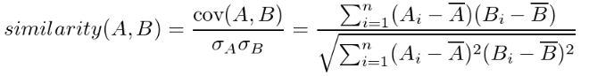

## Classification of recommendation algorithms with examples

1. **Non-parametric approach (memory-based)** - use information about/from users or items to create ratings computing similarities between users or items

    - **User-item filtering** - create similarity rating of all users -> take particular user -> find another users that are similar to that one based on similarity rating -> recommend items that those users like (people also like ...)
   
    - **Item-item filtering** - for each item find users who liked that item -> find other items that those users or similar are also liked (people buy with that ...)
    
        

    
        (the next methods can be used both for user-item or item-item filtering)
        
        - **KNN (K-nearest neighbors)** - create training dataset with classes (likes / dislikes tip of the day). For every item in test set (unlabeled data) compute distance to each item in training set, than sort all distances and take first K which are nearest neighbors. K numbers is usually taken as 3,5,7,9, … and should be fine tuned based on data.
        
        

        
        - **Metric distance cosine similarity** - measures the similarity between two vectors in n-dimensional space by computing the angle between two vectors projected into multidimensional space. Features in those vectors could be keywords, some numerical features, binary features and so on.
        
        

        - **Metric distance Pearson similarity** - is the covariance of two n-dimensional vectors divided by the product of their standard deviations. Features in those vectors could be keywords, some numerical features, binary features and so on.
        
        

2. **Parametric approach (model-based)** - use ML algorithms to make recommendations

    - **Clustering based algorithms** (unsupervised learning algorithms) - the task is to group a set objects is such way that objects in the same group are more similar to each other than to those in another groups (clusters). We don’t need training sets.

        - **K-means (centroid-based clustering)** - randomly initialize K centroids, compute the distance (e.g. euclidean) from each cluster to each point, and each point will take the number of the nearest centroid. Than centroids will shift to the center of their nearest points, and again the distances will being computed until there would be no changes of all points’ classes.
        
        

        - **Agglomerative (hierarchical clustering)**  - this method seeks to build a hierarchy of clusters (“bottom-up” approach) which is perfectly visualized as tree or dendrogram view. The idea is very simple: find the shortest distance between points and connect them until there wouldn’t be one cluster. Then pick a threshold and cut all connections which are above (look at dendrogram), so we get N clusters where the number N depends on data and chosen threshold.
        
        

    - **Matrix factorization based algorithms** - suppose we have rating matrix where lines - users and columns - films and cells contain user ratings. We can compare users by their ratings and find similar users but usually the matrix is sparse, so many films won’t be seen. Matrix factorization helps to avoid this problem finding two rectangular matrices with smaller dimensions from a rating matrix obtaining the best factors to approximate the ratings we have.

        - **SVD (singular value decomposition)** - reduces the N of features of a data.  X denotes the utility matrix, and U is a left singular matrix, representing the relationship between users and latent factors. S is a diagonal matrix describing the strength of each latent factor, while V transpose is a right singular matrix, indicating the similarity between items and latent factors.
        
        

3. **Hybrid** - this type of recommender system combines some methods overcoming the limitations of each method (e.g. memory-based + model-based approaches or content-based + item-item filtering and so on)

4. **Deep Learning in recommendation systems** - those methods can leverage with big amount and different types of data. Those methods are flexible and powerful.

    - **Recurrent Recommender Network** - predicts future behavior trajectory. Use Long Short-Term Memory (LSTM) autoregressive model.
    
    

