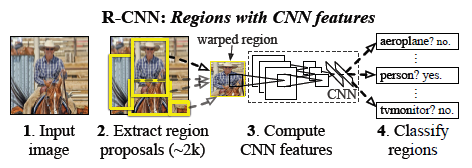
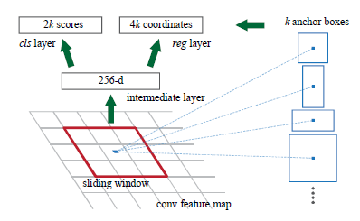

### R-CNN

До этого использовались сложные ансамбли нескольких низкоуровневых признаков (SIFT, HOG и т.д.) с высокоуровневым контекстом, а сверточные сети в задачах обнаружения объектов обычно использовались в качестве скользящих окон в течение многих лет.  Авторы же используют парадигму “распознавание с помощью регионов”, и применяют сверточные сети для поднятия “снизу-вверх” регионов, чтобы локализовать и сегментировать объекты 

**Основные шаги R-CNN:**

1) **генерация регионов** (предложение регионов), осуществляемая с помощью метода селективного поиска 

2) **сверточная сеть**, состоящая из 5 сверточных слоев и 2-ух полносвязных слоев, извлекает вектор признаков фиксированной длины, т.е. каждый регион приводится к одному размеру с помощью аффинного преобразования, и на выходе получаем вектор признаков (обычно 2000 х 4096, где первое число варьируется в зависимости от количества регионов). Сверточная сеть была предварительно обучена на ILSVRC2012 датасете и изменена под задачу обнаружения объектов (регион с >= 0.5 IoU - positive class, <0.5 IoU - negative class. Порог может быть другим), что помогло увеличить результат и помочь в задачах с малым объемом размеченных данных.

3) для каждого класса оптимизируется **линейный SVM**, решая задачу классификации региона, т.е. присвоения класса.

4) для отображения более точных координат используется **линейная регрессия**

Во время теста метод создает около 2 тыс. независимых от категорий регионов для входного изображения, извлекает вектор признаков фиксированной длины из каждого предложенного региона, используя CNN, а затем классифицирует каждый регион с помощью линейного алгоритма SVM.

**Недостатки:** 

1) последовательные этапы (Selective search -> сверточные сети -> SVM -> bounding-box regressor)

2) при усложнении сверточной сети сильно растет потребление памяти и время вычислений, особенно потому что каждый регион проходит через сверточную сеть по отдельности

3) медленная детекция объектов

### Fast R-CNN

Модификация алгоритма R-CNN, исправляющая недостатки R-CNN по скорости с дополнительным улучшением точности, за счет того, что обучение происходит за один проход, все слои сети обновляются, и не требуется сохранения признаков на диск.

**Алгоритм Fast R-CNN:**

1) на вход подается целое изображение и предложенные регионы 

2) несколько сверток и max-pooling свои создают карту признаков целого изображения, откуда для каждого предложенного региона извлекается вектор признаков фиксированной длины (region of interest RoI) с помощью polling слоя. 

*RoI pooling* слой использует max pooling с параметрами H x W (независимы для каждого RoI региона), чтобы превратить признаки региона в маленькую карту признаков. Каждый RoI задается кортежом (r,c,h,w), где (r,c) - координаты левого верхнего угла, (h,w) - высота и ширина региона. Далее весь RoI регион делится на h/H x w/W меньших окон, и производится операция max pooling.

3) каждый извлеченный вектор признаков подается на вход двум полносвязным слоям (2 ветки, они не связаны), решающих задачу *многоклассовой классификации* с помощью softmax, а второй слой - *bounding box регрессию*, для отображения более точных координат обнаруженного объекта

Дополнительным улучшением по сравнения с R-CNN является использование метода обратного распространения ошибки не в последовательном режиме, а с использованием mini-batch техники совместно с отбором R/N RoI регионов (например, R = 128, N = 2, тогда отберется 64 региона, что быстрее, чем брать каждый RoI из 128 разных изображений).

Также для увеличения скорости работы полносвязных слоев на выходе (дает хорошее улучшения скорости, когда количество RoI регионов большое количество) используется уменьшение слоя с помощью truncated singular value decomposition () путем создания двух слоев меньших размеров  (матрица весов) и матрицы **U**.

**Недостатки:** Fast R-CNN достигает скорости близкой к реальному времени, если исключить время, требуемое на создание регионов. Теперь создание регионов стало уязвимым местом в Fast R-CNN, отнимающее много времени

### Faster R-CNN

Наблюдение авторов состоит в том, что карты признаков, используемых в Fast R-CNN также могут использованы для создания регионов (region proposals). Сверху этих признаков и была построена region proposal network (RPN) путем добавления новых сверточных слоев, убрав при этом отдельный алгоритм поиска регионов Selective Search.

**Faster R-CNN состоит из 2-ух частей:**

**1-ая** - *глубокая полносвязная сверточная нейронная сеть*, находящая регионы (RPN)

**2-ая** - *Fast R-CNN*, использующая эти регионы

**RPN (region proposal network)**

Полносвязная сверточная нейронная сеть, на вход которой подается карта признаков, а на выходе выдает набор регионов с результатами, где предположительно расположены объекты, говорящими насколько вероятно то, что там находится объект,. Далее эти регионы передаются сети Fast R-CNN как бы говоря ей, куда нужно смотреть.

По карте признаков проходит скользящее окно и в нем содержатся k якорей. С каждым якорем ассоциируется bounding box и некоторое число, обозначающее вероятность нахождения объекта внутри этого региона.

## Ответы на вопросы

**1.  Пусть |scales| = S, |aspect ratios| = R и feature map размером W x H, сколько всего имеется якорей?**

Пусть одно скользящее окно состоит из k якорей, где $k = (scales) х (aspect ratios) = S х R$

Количество якорей в Faster R-CNN = $W х H х k$ =>

Общая формула = $W х H х S х R$ якорей

**2. Как быть с якорями выходящими за пределы изображения? Почему это проблема?**

Не нашел этого момента в оригинальной статье, но заглянул в реализацию на [github ](https://github.com/rbgirshick/py-faster-rcnn/blob/781a917b378dbfdedb45b6a56189a31982da1b43/lib/rpn/anchor_target_layer.py#L110). Все якори, выходящие за пределы отбрасываются.

Проблема состоит в том, что эти лишние якори сначала создаются, а затем отбрасываются при условии выхода за границы изображения.

**3. Что такое translation invariant? Как оно помогает ускорять forward pass сети? (по сравнению, например, с Fast R-CNN)**

*Invariance* означает, что объект можно распознать, даже если он изменяется (например, сдвигается в сторону, переворачивается, увеличивается/уменьшается).

*Translation* имеет значение, что каждый пиксель объекта был перемещен в одном и том же направлении и был изменен как и остальные (например, сдвиг).

Обычно *translation invariance* достигается с помощью комбинаций операций сверток и max pooling. В Faster R-CNN это свойство достигается благодаря якорям в скользящем окне, а именно, их различной формы (пошире/поуже или размер) и положения (например, вытянутый горизонтально/вертикально).

Чтобы сравнить этот метод по скорости, разберемся с **Selective search**, используемого в Fast R-CNN. Идея селективного поиска заключается в создании большого количества регионов с дальнейшим объединением похожих в большие регионы. В Faster R-CNN есть фиксированное число якорей, например 9, которые хорошо находят объекты, просто взяв признаки, входящие внутрь каждого региона, тем более при таком количестве итак выполняется свойство инвариантности. 
Авторы также указывают на малое количество параметров по сравнению с методом MultiBox, использующего алгоритм k-means для создания 800 якорей (свойство инвариантности может и не выполняться!), что также увеличивает скорость обучения.

**4. Как происходит выбор якорей для позитивной/негативной классификации? Правильно ли будет оптимизировать loss-функцию сразу на всех pos/neg якорях?**

Во время тренировки RPN для каждому якорю присваивается бинарный класс (0 - отрицательный, 1 - положительный). Особенностью такого присвоения является то, что каждому размеченному объекту может быть присвоено несколько якорей. 

**Критерии присвоения:**
- *Положительный класс*
    - Якоря с наибольшим результатом пересечения с размеченными объектами по метрике Intersection over Union (IoU)
    - Если пересечение якоря с размеченным объектом по метрике IoU превышает 0.7
- *Отрицательный класс*
    - Если пересечение якоря с размеченным объектом по метрике IoU ниже 0.3

Стратегия обратного распространения ошибки является “image-centric”. Оптимизировать loss-функцию можно для всех якорей, но отрицательных классов больше, что приведет к некоторому *смещению в сторону отрицательных классов*, поэтому из всех возможных якорей изображения случайным образом выбирается 256, так чтобы соотношение классов было 1:1 (т.е. 128 на 128 по соотношению якорей). Если же якорей с положительными классами будет меньше, то недостающие якори заполняются негативными классами.

**5. Кратко поясните процесс обучения общей сети, использующейся в экспериментах. Почему он так выглядит?**

Вся сеть тренируется по принципу 4-ех ступенчатого алгоритма обучения с помощью чередующейся оптимизации. 

- Обучается RPN, инициализируемая предтренировочными весами.
- Обучается Fast R-CNN, также инициализируемая предтренировочными весами, используя предложенные регионы сетью RPN.
- На этом этапе фиксируются общие сверточные сети и оптимизируются только слои, относящиеся к RPN.
- Теперь две сети имеют общие сверточные сети, которые затем снова фиксируются, и уже происходит оптимизация слоев Fast R-CNN. Далее, обе сети снова имеют общие сверточные сети и такой процесс повторяется в течение всего обучения.

Сети RPN и Fast R-CNN отличны друг от друга и выполняют разные функции. В forward propagation RPN лишь помогает Fast R-CNN взглянуть в “нужные” места, а на этапе backward propagation каждая из них оптимизируется по-разному, получая обратную связь от лосс-функции, поэтому важно замораживать общие слои.

**6. Что такое fully convolutional сети? Предположите, зачем они нужны в контексте object detection.**

*Fully convolutional network* является архитектурой, состоящей из convolution, pooling, upsampling слоев. Это та же сверточная нейронная сеть, где комбинации сверток и max pooling представляют собой *downsampling* часть, кодирующие признаки изображений, уменьшая его, но увеличивая признаковое пространство. Отличие от CNN состоит в слое upsampling, который создает *upsampling* часть, возвращая признаки к исходному изображению. Таким образом, downsampling часть отвечает на вопрос *“что на изображении”*, а upsampling часть *“где на изображении”*. Такая возможность позволяет использовать FC в задачах обнаружении объектов, сегментации и др., чтобы локализовать объект на изображении.

**7. Какие процедуры делаются на этапе теста для выбора лучших якорей и финальных ответов. Кратко опишите их.**

Во время обучения пересекающиеся якоря игнорируются, поэтому они не вносят вклад в loss функцию, а их количество уменьшается из расчета на одно изображение. В противном случае возникла бы ошибка объективности и сеть бы не сходилась.

Во время тестирования могут возникать пересекающиеся boundary boxes, и они лишь обрезаются под размер изображения, чтобы не выходили за границы. Но чтобы уменьшить избыточность, применяется некоторое подавление предложенных регионов, исходя из присвоенных результатов класса, путем установления некоторого порогового значения IoU, например в 0.7, оставив тем самым около 2000 предложенных регионов из расчета на изображение. После этого применяется ранжирование (top-N) регионов.

Пороговое значение можно изменять, увеличивая скорость работы сети путем уменьшения количества предложенных регионов, но достигая некоторого нижнего уровня, будет уменьшаться точность.
Параметры якорей также можно изменять, изменяя соотношение их сторон (1:1, 1:2, 2:1 и т.д.) или размер в пикселях (128х128, 256х256, 512х512, ...). Из результатов тестирования на PASCAL VOC 2012 из оригинальной статьи видно, что изменение и увеличение этих параметров могут помочь достичь лучших результатов.
